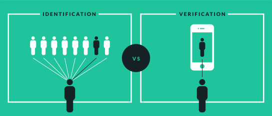

If you're seeing ugly html here, please visit the the website, as linked above. GitHub default readme parsing won't support math formulas, and this document makes use of them.

Security And Forensics
===================

Table of Contents
------------------------
- [ ] TODO!

Adversaries and Attacks
---------------------------------
aka _How to become a scammer in 419 steps_.

### Adversaries
- Individuals
    - Hackers/Crackers ─ Curiosity/Amusement
    - Lone Criminals ─ Financial Gain
    - Insiders ─ Revenge, Financial Gain
- Organizations
    - Business ─ Industrial Espionage
    - Organized crime ─ Financial Gain
    - Terrorists ─ Information Gain, Financial Gain, Attack Infrastructures
    - Governments ─ Surveillance

### Attacks
- Criminal
    - Fraud
        - Scams Emails
            - 419 scam
            - Advance-fee scam
        - Phishing
            - Fake websites to steal credentials
        - Virus
     - Damage
         - Motivated by, terrorism, malice and revenge
         - Shutdown of infrastructure
         - Deletion of data
    - Intellectual Property Theft
        - Theft of design documents, source code, patents, etc.
        - Warez websites for multi-media
    - Identity Theft
        - Steal personal information to carry out further offence
    - Data Theft
        - Steal confidential information from websites where it is normally stored
- Privacy
    - Surveillance
        - Monitoring a user activity to retrieve useful information
    - Traffic Analysis
        - Monitoring a user activity to find navigation pattern between websites
- Adverse Publicity
    - Denial of Service
    - Blackmail
    - Website Defacement

Secure System Requirements
-----------------------------------------
A secure system is comprised of:
- Privacy
- Anonymity
- Authentication
- Authorisation
- Integrity
- Audit

### Privacy
Privacy is "_a state of being free from being observed or disturbed by others_".

#### Privacy in the society
Prior to the internet days, it was hard to find data (especially personal), because of the difficulty of obtaining it. Now it is extremely easy do surveillance on someone, from both individuals and organisations.

The concept of privacy varies from country to country and person to person.

In the E.U. the personal data is owned by you, and companies are not allowed to sell it. Conversely, in the U.S. the company owns it, and it can be sold to other companies (for profit, marketing, etc.).

It is important to be aware of privacy issues, as our decision might shape what will be of our personal information in the future. The E.U. seems to be on the right way for now, good job us! :)

##### Data Protection Act (DPA)
The Data Protection Act is designed to protect citizens' privacy and enforce how organisations handle information relating to them.

The DPA can be summarised in eight principles:
- Data should be fairly and lawfully obtained
- It should be held only for a specific and lawful purpose
- It should be relevant to the task
- It should be accurate and up to date
- It should not be kept for longer than necessary
- It should be processed in accordance to the rights of the owner
- It should be kept securely and not misused
- It should not be transferred out of the European Economic Area, unless the destination has an equivalent level of data protection

##### Regulation of Investigatory Act (RIPA)
In contrast with DPA, RIPA allows government agencies to monitor citizen's activities, if they are suspected of a crime. It imposes the ISP to keep browsing history, and allows said agencies to access it at any time.

##### General Data Protection Regulation (GDPR)
GDPR is a regulation in EU law that:
- gives control to the individuals over their personal data
- simplifies the regulatory environment for internation business unifying the regulation within the EU.

##### Data mining
Big software companies like Google and Facebook make most of their profit by using user's data to make targeted advertisements, and selling the data to interested parties.

### Anonymity
"_The situation in which someone's name is not given or known._"
- Removes bias
- Allows whistleblowers to reveal details without fear
- Removes trust barriers

Anonymity can be useful to guarantee the privacy of users, on the other hand it can be easily exploited by people with malicious intent.

### Authentication
Authentication is the process of identifying an individual as being genuine and not an impostor.

- An **individual** is a unique person
- An **identity** is a character string or a similar descriptor 
    - it doesn't have to belong to one individual
    - entitles an individual with certain actions
- An **attribute** is a characteristic of an identity

Common types of authentication mechanisms (identity authentication) checks if an individual:
- **knows**
    - Password, PIN, date of birth, mother's date of birth (!)
- **has**
    - Card, key, uniform, badge, ID
- **is**
    - Face, fingerprint, iris scan

Authenticating an individual is not particularly simple, on the other hand, as it relies on documents and from other people.

Authentication might affect your privacy, as it is simple to collect data from multiple sources that can be linked to a specific individual (credit cards, loyalty cards, bus cards, etc.)

#### Methods
##### Passwords
Passwords and PINS (Personal Identification Number) are are a method of identification that require an individual to remember something to prove that they _are_ the associated user.

Passwords are often common words, and can be mine from breached databases. They are often reused, causing security issues, if one of the services has leaked information.

Passwords are usually stored using a hash function in a file. This will prevent the actual password to be disclosed in the file.

Possible attacks include:
- Brute force combinations
- Use a dictionary with common passwords
- Search user background (pet, partner, birthday)
- Social engineering

##### One-Time Passwords
The system asks the user to insert a one time password that is generated by another device (dedicated, or mobile phone). This is often used in combination with a password (2-factor authentication).

This was initially only used by online banking, now all major services offers it as an additional layer of security.

##### Biometrics
Biometrics are an automated method for recognising individuals based on measurable biological and behavioural characteristics.

They don't require the user to remember anything, and are often considered safer than password.

###### Issues
- They can be intrusive and costly
- They have a specific false rates. What can be considered a good threshold?
- Should they be an equivalent to a user name?
- Single point of failure
- They are are secure as the link between the scanner and the system
- What if your biometric measure is stolen or forge? 
    - You buy a new finger/retina/voice, duh.

###### Biometric authentication:
- Fingerprint Recognition
    - Pattern matching
    - Sometimes unusable
    - Requires hardware
- Vascular Pattern Matching
    - LED Infrared light
    - Not always viable
    - Requires hardware
- Iris Recognition
    - Uses infrared light
    - Converts images to vectors
    - Still requires development
- Facial Recognition
    - Location and position of facial features
    - Depends on the lighting conditions
- Voice Verification
    - Pitch, intensity, quality and duration.
    - Background noise
- Hand Geometry
    - Scans features of the hands
    - Unreliable
- Dynamic signatures
    - Velocity, acceleration and speed
    - Can be reproduced by forgers
- Retina Recognition
    - Most secure biometrics
    - Unique to each person
    - Requires specific hardware
    - Requires high effort from the person

#### Identification vs Verification
**Identification** and **verification** are two types of _authentication_.

We'll take in account the example of biometric identification and verification.

**Verification** systems seek to answer the question "*Is this person who they say they are?*" Under a verification system, an individual presents himself or herself as a specific person. The system checks his or her biometric against a biometric profile that already exists in the database linked to that person’s file in order to find a match.

Verification systems are generally described as a `1-to-1` matching system because the system tries to match the biometric presented by the individual against a specific biometric already on file.

**Identification** systems are different from verification systems because an identification system seeks to identify an unknown person, or unknown biometric.

The system tries to answer the questions "*Who is this person*?" and must check the biometric presented against all others already in the database. Identification systems are described as a `1-to-n` matching system.

#### Access Rights
Identifying what a user can do is as important as important as identifying who they are in the first place.

If a breach occurs for a standard user, the damage should be limited.

It is assumed that system administrator are much more careful in handling their authentication process.

Nowadays operating systems have an **Access Control List** that maps the rights that each user has towards a specific object (file).

Unix systems have a very strict and granular permission policy, with permission groups and different flags. This is because they were designed to be multi-users operating systems from the start.

**Databases** have similar access control lists, with users and groups. When properly designed, a database should only allow the minimum required rights to a user. For instance, a client that is only required to read data from a table, should only have rights to read that table, and nothing else. 

Virtual memory per user was introduced, in order to prevent an user, to access (peek, write) another user's or system's memory.

### Authorisation
Authorisation restricts what an authorised identity can make.

This is to protect the systems and data from the users.

### Integrity
Integrity is concerned with ensuring that information is genuine and has not been tampered with.

In modern days it easy extremely easy to forge and manipulate the truth with fake media. It is important to understand what is true, and what is not.
One way of achieving this is __accountability__ or __auditing__, knowing when who has done what.

### Audit
Auditing is the process of conducting a systematic review of something.

In computer terms, it requires logging and recording all the actions the users have done on the system.

This can be useful to have an history of the files, but also to find trails left by users with malicious intent. An audit mechanism also acts as deterrent.

Audit logs can still be hacked and covered by skilled attackers.

Computer Forensics
----------------------------
Computer forensics is the practice of collecting, analysing and reporting on digital data in a way that is legally admissible. It can be used in the detection and prevention of crime and in any dispute where evidence is stored digitally.

A **digital evidence** is any piece of information being subject to human intervention or not, that can be extracted from a computer, that is presented in a human-readable format, for instance, to be presented in a court of law.

Computer forensics is used by:
- Criminal prosecutors
    - to prosecute suspects and use evidence
- Civil litigations
    - use of digital evidence in civil cases
- Insurance companies
    - use digital evidence to find frauds
- Private corporations
    - use digital evidence to civil cases (harassment, fraud, embezzlement)
- Law Enforcement Officials
    - use computer forensics to backup search warrants
- Individuals
    - use of digital evidence as support of civil cases

### The Incident Response Process
#### Preparation
During this phase a Incident Report Team (IRT) is set up, and the System is prepared to avoid, mitigate and logs eventual attacks.

- **Checksum**
    - Make a checksum of all the relevant files on a clean machine
    - Store the checksums on a non-networked machine so that they cannot be altered
    - Update the checksums if the critical files are updated (e.g. software update)
- **Logging**
    - Configure full logging
    - Configure remote logging, if local machine logs get deleted
- **Defences**
    - Install all updates and patches
    - Disable/Uninstall unused software and services
    - Update all default passwords
    - Have updated and redundant backups
- **Network**
    - Set up firewall
    - Set up DMZ (perimeter network)
    - Set up Access Control List for router
        - Only whitelisted devices should be allowed
    - Maintain an accurate map of the network topology
    - Encrypt network traffic where possible
    - Require network authentication
- **Policy**
    - Make sure that the weakest ring of the security chain, humans, are behaving according to a strict policy
    - Do background checks
    - Make sure that the company policy allows the IRT to read through hard drives and emails

#### Detection
Prepare the system so that if an intrusion happens, it is detected and an appropriate response is followed.

##### Data mining
Data mining can be used to automatically detect:
- Intrusions
- Malicious code
- Buffer overflows
- Email worms

###### Intrusion Detection
Traditional malware detection is _signature-based_, meaning that it detects the exact bytes (or portion of such) of the malicious code. This makes it not effective against newly spreading malware (until they are detected a the malware registry is updated), and against malware that purposefully alter their code to avoid detection.

Automated detection can have two approaches:

- Behavioural
    - Analyse the sources, name addresses and activity of the malware
- Content-based
    - Analyse the byte content of the malware
    - Look for autographs (known signatures)
    - Look for n-gram (known pieces of code)

###### Buffer Overflow Detection
Machine learning can be used to detect buffer overflow vulnerability in both source code and compile machine code.

###### Malicious detection
With analogous methods, it is possible to use machine learning to detect viral emails, by analysing various features of the email.

#### Initial Response
Toolkit:
- MultiOS bootable machine
    - Windows
    - Linux
- Forensics Software
    - EnCase
    - SANS
    - Wireshark
- Clean bootable USB drive
- Ascii/byte/hex editor
- Disk write blocking software
- Hash of the toolkit
- Image of the toolkit

Recording the circumstances of the intrusion, and inform involved parties is key.

#### Data Collection
Collecting data from the affected computers is fundamental to understand what is the magnitude of the damage, and see if it has affected any other machine in the network.

- RAM
- Timestamps
- Current users
- Current processes
- Open Sockets
- Application Listening on sockets
- Complete list of external systems that have a current or recent connection to the system (ssh, telnet, remote desktop)
- Timestamps for all files
- Copy of system registry and configuration files

#### Data Analysis
Once the data has been collected from the victim machine, they are moved to another machine to be analysed.

- **Examine running processes**
    - Examine process ownership
    - Examine process tree
    - Cross check with list of open sockets
    - Scan memory for executables and suspicious strings
    - Submit binaries to anti-virus software for analysis
    - Examine binaries with hex code
- **Check**
    - RAM
    - Fee space for deleted files
    - Logs
    - Changes to users/permissions
    - Swap files
    - Recycle bin
    - Recently changed files
    - Unusual file names
- **Analyse network**
    - Captured network traffic can be analysed with software like Wireshark
    - Check router logs

### Media Forensics
#### Digital Watermarking
Digital watermarking identifies the author of a media, embedding the information directly on the image, in a way that is imperceptible, robust and secure.

Applications:
- Copyright protection
- Owner identification
- Content authentication
- Broadcast monitoring
- Transaction tracking
- Digital rights management (DRM)
- Tamper proofing

#### Image Forensics
Kids that downloaded a pirate copy of Photoshop (and dictators alike) tend to manipulate pictures. How can an educated computer science student with too much free time spot these fakes? Let's find out in 404 simple steps!
- Repeated patterns
- Gross logical error
- Images cut badly with Microsoft Paint should be a given, yes?
- Direction of lighting/shadows (lighting discrepancies)
- Eyes twinkles (specular highlights)
- Camera fingerprint
    - Each camera model produces an unique noise due the sensor
- Images come with EXIF metadata
    - Location
    - Time 
    - Camera model
    - They can all be spoofed, of course! :)

Cryptography
-------------------
Cryptography is the study and practice of **protecting information** by **data encoding** and **transformation techniques**.

Encryption allows to:
- hide information (privacy)
- authenticate information
- guarantee integrity

Cryptography plays an important role in **identity authentication** (passwords, certificates).

Cryptography is also important in **data integrity**, as digital data can be associated with a (short) digital fingerprint, that will change even if one bite has been altered (hash/checksum).

#### Terminology
- $$S$$ - Sender
- $$P$$ - Plaintext
- $$E$$ - Encryption/Encipher function
- $$C$$ - Encrypted text
- $$D$$ - Decryption/Decipher function
- $$R$$ - Receiver

### Symmetric and Asymmetric Encryption
Encryption method can use one more more keys $$K$$ to so that:

$$C = E(K, P)$$

An algorithm where $$C = E (K, P),\ P = D(K, C)$$ is defined **symmetric**. In other words, the same key $$K$$ can be used for both encryption and decryption.

Conversely, algorithms that follow the rule $$C = E (K_1, P),\ P = D(K_2, C),\ K_1 ≠ K2$$ are known as **asymmetric**. They can be more secure in certain circumstances (opening a secure channel). Asymmetric encryption is very computationally taxing.

### Cryptographic Algorithms
A **cipher** is an algorithm for performing encryption or decryption, a series of well-defined steps that can be followed as a procedure.

// TODO Covers this in more details!

- **Substitution ciphers** — confusion
    - Caesar cipher - rotates characters
    - Book ciphers - homophonic substitution cipher
- **Transposition ciphers** — diffusion
    - Route ciphers
    - Columnar Ciphers

### Cryptanalysis — Cryptographic Attacks

**Cryptanalysis** is the process of breaking ciphers. 

There are a few ways of breaking a cipher:
- Recognise patterns in text
- Infer meaning by noting communication patterns
- Find the decryption key
- Find mathematical weaknesses of the cipher and exploit them (brute force?)

Any algorithm is theoretically breakable, but in practice an algorithm that would take too long to decipher is considered **unbreakable**.

Symmetric and asymmetric algorithms have different vulnerabilities:

- **Symmetric**
    - Brute force
    - Common patterns
- **Asymmetric**
    - Known algorithm
        - Challenge is to find the key

Looking for patterns is a very effective way against substitution ciphers.

For a given language, the frequency of letters and words is known. This can be used to guess which character/word is which, allowing to progressively make a decryption algorithm, trying a small set of substitutions until they make sense. One-time pads and book ciphers are particularly effective against common patterns exploitation.

### Creating Encryption Algorithms
#### Shannon's Rules
- Required secrecy should determine effort involved in encryption/decryption
- The set of possible keys should be simple and relatively unrestricted
- The implementation of the encryption algorithm should be as simple as possible
- Errors introduced in the cipher process should not propagate and corrupt the rest of the message
- The size of the cipher should not be larger than the plaintext

#### Stream vs Block Ciphers
There are two main types of ciphers: **stream ciphers** and **block ciphers**.

**Stream ciphers**
- Encipher plain text one character at a time
- Do not require the complete message to encrypt
- Useful for secure channels (streams)

**Block ciphers**
- Block ciphers encipher the whole block of plain text
- Required the data to be collated in chunks
    - Some require the whole plaintext to encrypt
    - They don't leave patterns in the text

#### Confusing vs Diffusing
There is also a distinction between **confusing** vs **diffusing** ciphers.

**Confusing ciphers**
- Changing one plaintext letter should not enable a cryptanalyst to determine the effect on cipher text
- Substitution ciphers are not confusing
- One-time pads and book ciphers are confusing

**Diffusing ciphers**
- Aims to spread the plaintext information throughout the cipher text
- Higher diffusion requires longer cipher text to be broken

#### Comparison Matrix

|               | Stream                       | Block                           |
| ------------- | ---------------------------- | ------------------------------- |
| Advantages    | Speed, low error propagation | Strong diffusion                |
| Disadvantages | Weak/no diffusion            | Slow, weak to error propagation |

### Using Encryption
#### Commercial Encryption
Commercial-grade encryption should:
- Be derived from solid mathematical principles
- Analysed and tested – peer review
- Withstand repeated real world usage

Currently used commercial-grade encryption algorithms:
- Symmetric
    - **DES** — Data Encryption Standard
    - **AES** — Advanced Encryption Standard
- Asymmetric
    - **RSA** — Rivest-Shamir-Adelman

##### Data Encryption Standard (DES)
DES is a **symmetric** key cipher with a 56 bit private key.

Method:
- Applies 16 iterations of substitution and diffusion
- Uses standard arithmetic and logical operators
- Suitable for operations on a standard PC or chip
- Effectively weak 56 bit key

##### Advanced Encryption Standard (AES)
AES is a **symmetric** key cipher with a private key with variable length (128, 192, 245 bits)

Advantages:
- Fast
- Substitution and Transportation
- Repeat cycles of 10, 12, 14

Method:
- 128 bit blocks use 8 bit substitution — diffuses data
- Logical shift — creates a transposition
- Shift and Exclusive $$OR$$ — adds both confusion and diffusion
- Add sub key element – adds confusion and introduces key binding

##### Rivest-Shamir-Adelman (RSA)
RSA is an **asymmetric** cipher, using a set of **public** and **private** keys.

In RSA:
- $$P = E(D(P, e), d) = D(E(P, d), e)$$
- $$C = E(P) = P^e\ mod\ n$$
- $$P = D(C) = (P^e)^d\ mod\ n$$
Where $$e$$ and $$d$$ are the two keys.

#### Hash Functions
A **hash function** is a one-way function that can be used to map data of **arbitrary size** to data of a **fixed size**. The values returned by a hash function are called *hash values*, *hash codes*, *digests*, or simply *hashes*.

Hash functions are used in **data integrity**, as even a bit of difference in the input data, would return a totally different hash value. So it easy to spot if the data has been tampered with. 

Hash function are also used in **authorisation**, as they are generally used to store passwords in databases, so that they cannot be reversed.

Common hashing functions are:
- **MD5** — Message Digest 5
- **SHA** — Secure Hash Algorithm (family of three algorithms)
    - **SHA-1** – Fixed to 160 bits digest
    - **SHA-2** – Variable digest size: 224, 256, 384 or 512.
    - **SHA-3** – Final version. Arbitrary digest size.

#### Key Exchange
Asymmetric keys allow a receiver $$R$$ to ask a sender to $$S$$ so that a message that only $$R$$ is able to decode, even though $$R$$ has published an encryption key.

HTTPS, being based on TLS/SSL, uses key exchange and certificates to create a shared key, to create a secure channel that is then encrypted with a symmetric algorithm.

##### Diffie-Hellman
Diffie-Hellman is a key exchange algorithm and
allows two parties to establish, over an **insecure
communications channel**, a **shared secret key** that
only the two parties know, even without having
shared anything beforehand. 

**Note**: Although it uses the same principles of _private_ and _public_ key, Diffie-Hellman is **not** an asymmetrical encryption algorithm, as no encryption happens. On the other hand, it's a secure method of **creating** a shared private key, so that the communication can be encrypted using a symmetric encryption algorithm. It is, however, an essential building-block, and was in fact the base upon which asymmetric crypto was later built.

Alice and Bob exchange a large prime modulus $$p$$ and a generator $$g$$ (both represented as the common paint).

Alice and Bob separately decide two private numbers, $$s$$ and $$r$$ respectively (secret colours). Then they compute the to public keys as follows:

A: $$A_p = g^s\mod{p}$$

B: $$B_p = g^r\mod{p}$$

And publicly  exchange $$A_p$$ and $$B_p$$.

Then they both execute:

A: $$A_k = (B_p)^s \mod{p}$$

B: $$B_k = (A_p)^r \mod{p}$$

And here's the magic:

$$A_k = B_k = key$$

Both Alice and Bob have generated the same $$key$$, without that it was sent over an unsecure channel. At this point, Alice and Bob can use $$key$$ to communicate on a channel encrypted with symmetric algorithms.

In order for Eve, an eavesdropper, to figure out $$key$$, she would have to solve $$key=(g^s \mod {p})^r \mod {p}$$, which is (in principle) computationally hard.

> Okay, I think I actually understood this, my head is about to explode, bye.

#### Digital Signatures
Digital signatures guarantee that a particular identity (person/organisation) sent a message.

Digital signatures need to be:
- Unique — Impossible to forge.
- Authentic — Only the sender should be able to send a given signed message
- Immutable — It shouldn't be possible to change a signed message
- Finite – The sender should not be able to send the signed message twice

Asymmetric Digital Signatures rely on the fact that algorithms such as RSA are commutative:

$$P = E(D(P, K_1), K_2) = E (D(P, K_2), K_1)$$

> This is probably wrong in the slides.

Meaning that a private key of a set can be used to:
1. Decrypt a message only intended for the recipient, which may be encrypted by anyone having the public key (**asymmetric encrypted transport**).
2. Encrypt a message which may be decrypted by anyone, but which can only be encrypted by one person (**signature**).

The process:

**Alice** sends a cipher text version $$C$$ of the message $$P$$ such that $$C = E(P, K_{a-priv})$$.

**Bob** performs the operation $$P_1 = D(C, K_{a-pub})$$, which is equivalent to $$D(E(P, K_{a-priv}), K_{a-pub})$$.

If $$P_1 = P$$ the message is guaranteed to be from Alice. If $$P_1 ≠ P$$, the message was not from Alice, or it was tampered with.

#### Digital Certificates
A **digital certificate**, also known as a **public key certificate** or **identity certificate**, is an electronic document used to prove the **ownership** of a public key. The certificate includes information about the **key**, information about the identity of its owner (called the **subject**), and the digital signature of an entity that has verified the certificate's contents. 

If the signature is valid, and the software examining the certificate trusts the issuer (CA), then it can use that key to communicate securely with the certificate's subject.

Steps:
1. The developer:
    1. Generates their own public/private key pair
    2. Creates a Certificate Signing Request (CSR) containing information about the identity
    3. Sends CSR to Certificate Authority (CA)
2. Certificate Authority:
    1. Checks Integrity of CSR
    2. Checks authenticity of CSR ID
    3. CA Creates a certificate containing identity and signed via CA private key
    4. The certificate public key is available, allowing the CA signature to be checked via decryption
3. The developer:
    1. Publishes an application
    2. Signs it with the private key and provides CA signed certificate as verification
    3. The developer's public key verifies the app, the CA's public key decrypts the certificate and indicates that the developer's identity is valid.

#### Trust
Digital certificates allow to establish a trusted connection between two parties that have never met. This is a centralised approach, because it all depends on the CAs to be valid and trustworthy.

For both political and security reason, it could be argued that the certificate authority shouldn't be centralised, rather be distributed between all the peers on the network, this leads to the creation of blockchain, where the trust is given by the majority of the peers accepting something as true.

Securing Software
--------------------------
### Managing Passwords
When designing a system, it is best to decide not to store passwords as plaintext, as they would be vulnerable in case of a breach.

Normally, passwords are stored as _salted_ hashes, since reversible encryption is not required. A salt is to prevent that someone creates a `plaintext -> hash` table (_rainbow tables_), that would be easy to search. A salt is stored along the username and is added to the password (hence the name), so that is randomised. A salt is a random sequence of bytes. This way, even if two users have the same password, the salted hash will be different.

$$stored = hash(password + salt)$$

When the users enters a password $$p_1$$ to attempt the login, the salt $$salt$$ is fetched from the username.

$$s_1 = hash(p_1 + salt)$$

if $$s_1 = stored$$ the user is authenticated.

### Estimating Program Security
- Core software testing investigates
    - Software Design Requirements
    - User Requirements
    - Boundary Condition
- Inadvertent Code Flaws
    - Validation
        - Improper validation
        - Improper permission checks
    - Domain
        - Data access controls
        - A user has access to data they are not authorised
    - Serialisation
        - Program control flow
    - Identification/Authentication
        - Invalid/weak ID checks
    - Boundary Conditions
        - Value limits (and 0)
        - Data collection
    - Logic errors

### Buffer Overflow
A **buffer overflow**, or *buffer overrun*, is an anomaly where a program, while writing data to a buffer, overruns the buffer's boundary and overwrites adjacent memory locations. This can be exploited by an attacker to inject malicious code in memory.

Programming in low level languages like **C/C++** (C, especially) makes it more likely to introduce buffer overflow vulnerabilities. **Java/C#** validate the buffer size at run time (making them slower), but are relatively safe on that point of view.

### Incompatible or Unexpected Data
If a conversion between two data types is possible (e.g. a 32 bit float to 32 bit integer), but not expected, it might result on an overflow (the number rolling over). This put the system in an inconsistent state (imagine it's a bank balance!), and/or crash it entirely. It might be even possible to inject malicious code.

### Escaped Sequences
Websites that uses scripting languages, are vulnerable to escaped strings being sent by the user that might get executed.

#### SQL Injection
It relies on escaping the intended use of a form field, so that an SQL query could be constructed and injected.

A typical attack consists in exploiting this vulnerability and gaining administrator rights to the website.

In order to prevent this (and similar attacks), it important to properly validate and sanitise inputs from user.

Rogue Software
----------------------

### Types of malware
Malicious software can be classified according to the way they propagate:
- **Virus** – Attaches itself to a program and runs with it
- **Trojan** – A decoy program distributed with the intent of hiding malicious code
- **Worm** – Spreads itself over the network (including emails)

Or on the way they are activated:
- **Time Bomb** — Activates the malicious code after a certain time
- **Logic Bomb** — Activates the malicious code when certain conditions are met
- **Back Door** — Allows the user to connect to a machine/program remotely

Finally, they can also be classified on what they do
- Shell (remote access)
- Key Logger
- Data deletion
- Security software disabler
- DoS

### Structure of a malware
A malware consists of three elements:
- **Execution Logic**
    - The code that makes the software run
    - It is usually hidden inside legitimate programs
- **Propagation Code**
    - The code required for it to spread towards:
        - New files
        - Over the network
- **The Payload**
    - The code that is carried by the malware and does the _damage_

### Computer Viruses
Not all malware are viruses. A virus is a specific type of malware that spreads by attaching itself to a program, so that when that program is executed by the user, the virus is executed as well.

### Trojans
A Trojan horse is any malicious computer program which misleads users of its true intent. They usually involve a legitimate or fake program, which has an embedded malicious code. Their payload usually involves a backdoor, that gives remote access to the attacker.

### Worms
Worms are stand-alone computer programs that spread over the network autonomously,  usually exploiting vulnerabilities.

### Detection of rogue programs
Rogue programs are usually detected by 
- what they do
- their signature
- system files being altered

Securing Network
-------------------------
Three threat exists when trying to access a networked service:
- The user pretends to be another user
- The user alters the network address of a workstation
- The user eavesdrop on exchanges and use a replay attack

### Network Attacks
- Reconnaissance
    - Social Engineering
    - Scans
        - IP scans
        - Port scans
        - Vulnerability scans
        - Fingerprint analysis (OS, services, etc. detection)
- Spoofing
    - Masquerading
    - Session Hijacking
    - Man in the Middle
        - ARP/DNS poisoning
- Denial of Service
    - DoS
    - DDOS
        - Usually sent from zombie PCs infected by a trojan
    - Smurf
        - Send in broadcast a ping with a forged sender IP
        - All machines reply to that IP address 

### Network Defences
- Firewalls
    - Allows only trusted and whitelisted connections
- Demilitarised Zone (DMZ)
    - Separates the internal network from a public one
- Virtual Private Network (VPN)
    - Allows user to access an internal network from outside in a secure manner
- Intrusion Detection System (IDS)
- Honey Pots
    - A highly-monitored machine deliberately left vulnerable, that will warn if under attack
- Vulnerability Scanners
    - Scan computers for known vulnerabilities... before the bad guys find out.
- SSL/TSL 
    - An application-layer that secures the communication happening on the transport layer, establishing a secure connection between two hosts.

### Kerberos
> **Kerberos** (/ˈkɜːrbərɒs/) is a computer network authentication protocol that works on the basis of tickets to allow nodes communicating over a non-secure network to prove their identity to one another in a secure manner. Kerberos builds on symmetric key cryptography and requires a trusted third party, and optionally may use public-key cryptography during certain phases of authentication.

Kerberos proves a centralised authentication server to authenticate users to a service.

Once the user is signed in on Kerberos, all the allowed environments secured by Kerberos are accessible to the user.

Firewalls make the (wrong) assumptions that all attacks come from the outside. With Kerberos, the assumption is that each connection between machines is a weak link in the security.

A client asks the authentication server (AS) a ticket granting ticket, with an authentication request. The AS provide the client with the TGT (if everything was okay), so the client has a temporary session where it is logged in the network. Next time the clients needs a ticket, it will ask right away to the server, and then call the required service.

Kerberos design principles:
- Encrypt connection between client and host
- Convenient for the user
- Protect against intercepted credentials (forward-secrecy ???)
- Centralised server that guarantees identity

